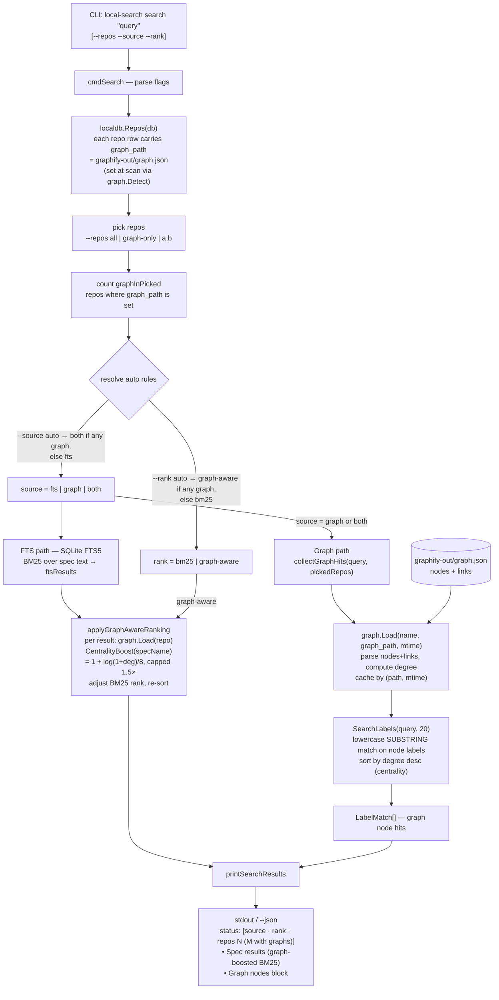

# local-search (Go)

A fast, offline spec registry with full-text search across multiple repos. Single Go binary, no runtime dependencies beyond the binary itself.

This is a full rewrite of `local-search.sh` in Go, addressing the core performance bottlenecks in the original bash script (N+1 sqlite3 subprocess spawns, no transactions, sequential file I/O).

## Contents

- [Why Go](#why-go)
- [Install](#install)
- [Quick start](#quick-start)
- [Commands](#commands) — [repos](#repo-management), [scanning](#scanning), [scan automation](#scan-automation-scan-hooks), [searching](#searching), [browsing](#browsing), [maintenance](#maintenance), [web UI](#web-ui), [JSON](#json-output-for-agent-pipelines), [aliases](#command-aliases)
- [Search syntax](#search-syntax)
- [How graphify powers search](#how-graphify-powers-search)
- [Supported file types](#supported-file-types)
- [Spec format](#spec-format)
- [File locations](#file-locations)
- [Database schema](#database-schema)
- [Git-based change detection](#git-based-change-detection)
- [Project structure](#project-structure)
- [SQLite driver](#sqlite-driver)

## Why Go

The bash script launched a new `sqlite3` process for every SQL statement — ~20ms per spawn, 500+ spawns for a typical repo scan. The Go binary eliminates this entirely:

| Bottleneck | Bash | Go |
|---|---|---|
| SQLite calls | 1 subprocess per statement | In-process `database/sql` |
| Transactions | None (auto-commit per stmt) | Single transaction per scan |
| Batch inserts | Loop of individual INSERTs | Prepared stmt + `executemany` |
| File I/O | `stat` + `readfile()` subprocesses | `os.Stat` + `os.ReadFile` in-process |
| File walking | `find` subprocess | `filepath.WalkDir` |
| Parallelism | Sequential | 4-worker goroutine pool for file reads |
| Startup | ~20ms (bash) | ~5ms (compiled binary) |

**Result:** full scan runs in ~30ms for typical repos.

## Install

```bash
# Build
cd local-search/cli
go build -o local-search .

# Install globally (optional)
cp local-search /usr/local/bin/local-search
```

**Requirements:** Go 1.25+ to build. No runtime dependencies — SQLite is compiled in via `modernc.org/sqlite` (pure Go, no CGO, no C toolchain needed).

## Quick start

```bash
# 1. Register your spec folders (auto-scans immediately)
local-search repo add ./product-specs product
local-search repo add ./platform-docs platform
local-search repo add ./docs docs --skip-directory .skills

# 2. Search — no manual scan needed, auto-detects changes
local-search search refund
```

Adding or removing a repo re-indexes only that repo (surgical — other repos are untouched, the DB is never wiped), and the index auto-detects file changes on git repos at query time.

## Commands

### Repo management

```bash
local-search repo add <folder> [name] [--skip-directory <folder-name>]   # Register a spec repo (auto-scans)
  # Example: local-search repo add /path/to/specs product
  # Example: local-search repo add ./docs docs --skip-directory .skills
  # Example: local-search repo add ~/code backend --skip-directory vendor --skip-directory .git
local-search repo remove <name>                                          # Unregister a repo (surgical: drops only its rows + flat-file entry)
  # Example: local-search repo remove product
local-search repo list                                                   # Show all repos with per-repo status columns
```

`repo list` prints a column per repo: name, date added, last-scan age,
last-index-update age, short (7-char) latest indexed commit, and path. Missing
values render as `—`. It tolerates an absent/unreadable DB (still lists
name/path/date-added, exits 0).

### Scanning

```bash
local-search scan                       # Surgical re-index of the repo the current directory is inside
local-search scan <repo-name>           # Surgical re-index of one repo (other repos untouched)
  # Example: local-search scan platform
local-search scan all                   # Full rebuild: delete the DB, recreate schema, re-index every repo
```

`scan` with no argument resolves the one registered repo your current directory
is inside (deepest match if nested) and re-indexes only that repo. If you are
not inside any registered repo it exits non-zero and tells you to `cd` into one
or run `scan all`. Surgical scans are atomic and never delete the database or
touch other repos' rows; `scan all` is the only full-rebuild path. `rebuild` and
`index` are exact aliases of `scan` (identical target resolution).

### Scan automation (scan-hooks)

Keep a repo's index fresh automatically as git activity happens. Operates on the
repo your current directory is inside (same resolution as `scan`; errors the
same way when outside any registered repo).

```bash
local-search scan-hooks install                                  # Prompt for which mechanism(s) to install
local-search scan-hooks install --mechanism git-hooks            # Install git hooks only
local-search scan-hooks install --mechanism git-hooks,shell      # Install both mechanisms
local-search scan-hooks install --mechanism git-hooks --force    # Refresh a stale managed hook block
local-search scan-hooks uninstall --mechanism shell              # Remove one mechanism's managed content
```

- `--mechanism <list>` — comma-separated, any of `git-hooks`,`shell`. Omit it to
  be prompted interactively for which to install.
- `--force` — replace a stale managed git-hook block in place.
- **git-hooks** — writes managed (sentinel-delimited) `post-merge`,
  `post-checkout`, and `post-rewrite` hooks under `.git/hooks/` (`post-commit`
  is intentionally excluded). Pre-existing user hook content is preserved; a
  non-git repo skips this mechanism with a message but still installs the others.
- **shell** — writes `~/.local-search/shell-hook.sh` and prints the exact
  `source <path>` line to add to your shell rc (it never edits rc files); the
  snippet triggers a scan when you `cd` into a registered repo.

When automation fires it runs a **surgical** scan of that repo. It is
non-blocking (the git hook always exits 0 and dispatches the scan detached),
change-gated (skips when no spec files changed since the last indexed commit;
non-git repos always scan), and guarded by a self-healing per-repo lock so
overlapping triggers are a no-op. `uninstall` removes only that mechanism's
managed content (deleting a hook file only if it becomes empty), and install is
idempotent.

### Searching

```bash
local-search search <query>             # Search all repos
  # Example: local-search search "payment refund"
local-search search <query> --repo <name>   # Search one repo (named flag)
  # Example: local-search search "webhook" --repo platform
local-search search <query> <repo>          # Search one repo (positional, legacy)
  # Example: local-search search "API endpoints" platform
local-search search <query> --directory <path>   # Focus to paths starting with <path>
  # Example: local-search search "checkpoint" --directory reference/
local-search search <query> --exclude-location <pattern>   # Exclude paths containing pattern
  # Example: local-search search "refund" --exclude-location deprecated/
local-search read <name>                                   # Print full spec content
  # Example: local-search read refund-flow
local-search read <name> <repo>                            # From a specific repo
  # Example: local-search read webhook-retry platform
local-search read <name> <repo> --directory <path>         # By repo and directory
  # Example: local-search read config backend --directory src/
local-search related <name>             # Find related specs by tags/title
  # Example: local-search related refund-flow
```

### Browsing

```bash
local-search list                       # All specs, grouped by repo
local-search list <repo-or-project>     # Filter by repo or project
  # Example: local-search list platform
local-search projects                   # All projects with spec counts
local-search tags                       # All tags with usage counts
local-search tags <tag>                 # Specs with a specific tag
  # Example: local-search tags billing
local-search recent [n]                 # Recently modified (default 10)
  # Example: local-search recent 20
```

### Maintenance

```bash
local-search stats                      # Index statistics
local-search db                         # Print database file path
local-search inspect                    # Dump full index contents
local-search reset                      # Delete everything and start over
local-search help                       # Full help text
```

### Web UI

Starts the local-search-ui web UI as a background daemon. Requires Node.js on
`PATH` and a built frontend (`cd web/frontend && npm install && npm run build`).

```bash
local-search ui                         # Start daemon (port 8787) and open the browser
local-search ui --port <n>              # Start on a specific port
local-search ui status                  # Show whether the UI is running
local-search ui stop                    # Stop the daemon
```

The Node server is spawned detached and its PID/port are recorded in
`~/.local-search/ui.pid` (logs in `~/.local-search/ui.log`). The web/ folder is
located by walking up from the binary and the CWD; set `LOCAL_SEARCH_WEB_DIR` to
override. See the top-level README's **Web UI** section for details.

### JSON output (for agent pipelines)

```bash
local-search json search <query> [repo]       # Search with optional repo
  # Example: local-search json search "payment" platform
local-search json read <name> [repo]          # Read with optional repo
  # Example: local-search json read refund-flow
local-search json list [repo-or-project]      # List by repo or project
local-search json repos                        # All registered repos
local-search json related <name>               # Related specs
local-search json tags                         # All tags
local-search json stats                        # Index statistics
```

### Command aliases

| Alias | Command |
|---|---|
| `rebuild`, `index` | `scan` |
| `s`, `find`, `f` | `search` |
| `r`, `get`, `show` | `read` |
| `ls` | `list` |
| `p` | `projects` |
| `rel` | `related` |
| `t` | `tags` |
| `j` | `json` |

## Search syntax

Uses SQLite FTS5 with Porter stemming — the same engine as the bash version.

```bash
local-search search refund                                   # keyword
local-search search "refund OR chargeback"                   # boolean OR
local-search search "billing NOT fraud"                      # exclude
local-search search refunding                                # stemming: matches "refund"
local-search search "payment*"                               # prefix
local-search search "refund eligibility"                     # phrase
local-search search "payment" --repo platform                # filter to one repo
local-search search "webhook" --directory billing/           # focus to directory
local-search search "event" --repo backend --directory integrations/  # combine repo and directory
local-search search "What Triggers a Checkpoint" --directory reference/  # multi-word search
```

## How graphify powers search

When a searched repo contains a graphify knowledge graph (`graphify-out/graph.json`,
auto-detected at scan via `graph.Detect` and stored as the repo's `graph_path`),
`local-search` folds that graph into results in two ways — and auto-enables it, no
flags required.



**Two mechanisms**

1. **Graph node hits** — `collectGraphHits` → `graph.SearchLabels` (`graph/graph.go`): a
   lowercase **substring match on node labels**, sorted by node degree (centrality).
   Surfaced as a separate `Graph nodes (N):` block in the output.
2. **Graph-aware re-ranking** — `applyGraphAwareRanking` → `graph.CentralityBoost`
   (`main.go`): a spec whose name matches a graph node has its BM25 rank boosted by
   `1 + log(1+degree)/8` (capped at 1.5×), so graph-central specs edge above near-ties.
   BM25 stays dominant.

**Auto-routing** — `resolvePlan` (`main.go`) counts graph-enabled repos in the picked
set and flips the defaults:

| Flag | `auto` behavior |
|---|---|
| `--source` | `both` (FTS + graph) if any picked repo has a graph, else `fts` |
| `--rank` | `graph-aware` if any picked repo has a graph, else `bm25` |

The `[source=… · rank=… · repos=N (M with graphs)]` status line above results shows the
resolved values.

**Explicit controls**

```bash
local-search search "notification" --repos graph-only       # only repos with graphify-out/
local-search search "notification" --source both|graph|fts  # force retrieval source
local-search search "notification" --rank graph-aware|bm25  # force ranking strategy
local-search graphs                                         # per-repo graphify status
local-search graphs add <name> <graph.json> --kind graphify # register a standalone graph
```

Matching against the graph is **lexical** (substring on labels), not semantic — vector
re-ranking is the separate `--semantic` path. `find` and `code` blend graphify with the
code-review-graph and specs using scope weights (specs `1.0`, graphify `0.7`, codegraph
`0.8`; see `scope/scope.go`).

## Supported file types

**Indexed directly** (content fully searchable):
- `.md`, `.mdx`, `.txt`

**Binary/media** (require a companion `.md` sidecar with the same base name):
- `.jpg`, `.jpeg`, `.png`, `.gif`, `.webp`, `.svg`, `.pdf`

Example: `architecture/diagram.png` is indexed using `architecture/diagram.md` as the content source.

## Spec format

Files are indexed with these fields:

| Field | Source |
|---|---|
| `name` | Filename without extension |
| `title` | First `# Heading` in the file |
| `tags` | YAML frontmatter `tags:` line (inline, comma-separated) |
| `summary` | First paragraph after frontmatter (max 300 chars) |
| `content` | Full file text (FTS-indexed) |
| `project` | First subdirectory name within the repo |

**Frontmatter example:**

```markdown
---
tags: billing, refund, customer, payments
---

# Refund flow

Customers may request a refund within 30 days of purchase...
```

## File locations

| Path | Contents |
|---|---|
| `~/.local-search/repos` | Registered repo list (one repo per line, see format below) |
| `~/.local-search/specs.db` | SQLite database (disposable cache — source files are truth) |

Each `repos` line is pipe-delimited with an optional 3rd skip-dirs field and an
optional 4th date-added field: `name\|path\|<skip-dirs>\|<added_at>`. When a repo
has a date-added but no skip-dirs, the 3rd field is left empty so the date stays
positional: `name\|path\|\|<added_at>`. Legacy 2- and 3-field lines
(`name\|path` and `name\|path\|skip1,skip2`) still parse — their date-added is
treated as unknown.

The database can be deleted at any time and will be rebuilt on the next command.

## Database schema

Identical to the original bash tool — the two are fully interoperable.

```sql
repos(id, name, path)
specs(id, repo, path, project, name, title, tags, summary, fullpath, modified, size, ext, content)
specs_fts            -- contentless FTS5, porter unicode61 tokenizer
spec_tags(spec_id, tag)
meta(key, value)     -- per-repo git_commit_<name>, last_scan_<name>,
                     -- last_index_update_<name>; plus a global last_scan (stats)
```

## Git-based change detection

For repos that are git repositories, the tool tracks the last-scanned commit hash in the `meta` table. On each query, it checks for:

- Committed changes since last scan (`git diff <last>..<current>`)
- Staged changes (`git diff --cached`)
- Unstaged changes (`git diff`)
- Untracked spec files (`git ls-files --others`)

Only changed files are re-indexed. For non-git repos, falls back to filesystem mtime comparison.

## Project structure

```
cli/
├── go.mod                  # Module: local-search, requires modernc.org/sqlite
├── main.go                 # CLI dispatch + repo file management (surgical add/remove)
├── scan_resolve.go         # resolveScanTarget(): CWD/name → surgical vs full-rebuild mode
├── scanhooks.go            # scan-hooks install/uninstall (git-hooks + shell mechanisms)
├── triggers.go             # scan-hook-run: change-gate + locked, detached surgical trigger
├── lock_unix.go            # Per-repo re-entrancy lock (flock); self-healing on crash
├── lock_windows.go         # Windows fallback lock (PID-file)
├── skill.go                # install-skill: embed + write the Claude skill
├── ui.go / ui_unix.go / ui_windows.go   # `ui` daemon lifecycle (spawn/status/stop)
├── extract/
│   └── extract.go          # Metadata parsing: title, tags, summary, content
│                           # Companion sidecar logic for media files
├── git/
│   └── git.go              # Git change detection and repo detection
└── db/
    ├── schema.go           # DDL, Open() (WAL + busy_timeout), GetMeta(), SetMeta()
    ├── index.go            # FullScan(), ReplaceRepo() (atomic surgical), IncrementalScan(), DeleteRepo()
    │                       # Worker pool for parallel file I/O
    ├── ftsquery.go         # FTS5 query construction/sanitization
    ├── vgraph.go           # Vector/graph search support
    └── query.go            # Search(), Read(), List(), Tags(), Stats(), etc.
```

## SQLite driver

Uses [`modernc.org/sqlite`](https://pkg.go.dev/modernc.org/sqlite) — a pure Go port of SQLite with no CGO requirement. FTS5 with Porter stemming is built in. Cross-compiles to any GOOS/GOARCH without a C toolchain.

Performance pragmas applied on every connection:

```sql
PRAGMA journal_mode=WAL
PRAGMA busy_timeout=5000    -- wait up to 5s for a lock instead of failing (concurrent scan + query)
PRAGMA synchronous=NORMAL
PRAGMA temp_store=MEMORY
PRAGMA cache_size=-32000   -- 32 MB page cache
```

WAL plus a bounded `busy_timeout` let a scan and a read contend on the same
database without the read failing or the index corrupting; surgical scans apply
their delete-and-reindex as a single atomic transaction, so a concurrent reader
sees either the pre-scan or post-scan index for that repo, never an empty
intermediate.
